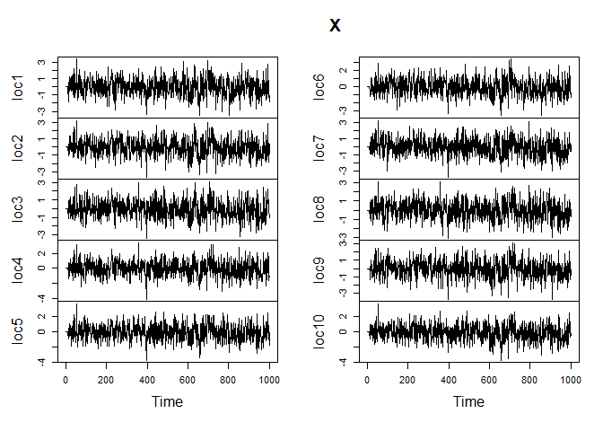

<!-- README.md is generated from README.Rmd. Please edit that file -->

# mcgf

<!-- badges: start -->
<!-- badges: end -->

The goal of `mcgf` is to provide easy-to-use functions for simulating
and fitting covariance models. It provides functions for simulating
(regime-switching) Markov chain Gaussian fields with covariance
functions of the Gneiting class by simple kriging. Parameter estimation
methods such as weighted least squares and maximum likelihood estimation
are available.

## Installation

You can install the development version of mcgf from
[GitHub](https://github.com/) with:

``` r
# install.packages("devtools")
devtools::install_github("tianxia-jia/mcgf")
```

## Data Simulation

To simulate a MCGF with fully symmetric covariance structure, we begin
with simulating 10 locations randomly.

``` r
library(mcgf)
set.seed(1234)
dists <- rdists(10)
```

Next, we simulate a MCGF with the general stationary covariance
structure. In this example the covariance structure is a convex
combination of a base separable model and a Lagrangian model account for
asymmetry.

``` r
par_spatial <- list(nugget = 0, c = 0.01, gamma = 0.3)
par_temporal <- list(a = 1, alpha = 0.5)
par_sep <- list(par_s = par_spatial, par_t = par_temporal)
par_lagr <- list(v1 = 10, v2 = 50, k = 2)

set.seed(1234)
X <- mcgf_sim(N = 1500, base = "sep", lagrangian = "lagr_tri", lambda = 0.5, 
              par_base = par_sep, par_lagr = par_lagr, dists = dists, 
              lag = 10)
plot.ts(X)
```



## Parameter Estimation

### Create an `mcgf` object

To estimate parameters, we need to calculate auto-correlations and
cross-correlations. Let’s first create an `mcgf` object. The `mcgf`
class extends the `data.frame` with more attributes.

``` r
train <- X[1:1000, ]
test <- X[-c(1:1000), ]
x_mcgf <- mcgf(train, dists = dists)
#> `time` not provided, assuming rows are equally spaced temporally.
```

Then the acfs and ccfs can be added to this object as follows.

``` r
x_mcgf <- add_acfs(x = x_mcgf, lag_max = 10)
x_mcgf <- add_ccfs(x = x_mcgf, lag_max = 10)
```

### Estimate base model

To perform parameter estimation, we can start with estimating the
parameters for spatial and temporal models.

``` r
fit_spatial <- fit_base(x = x_mcgf, lag = 10, model = "spatial", 
                        par_init = list(nugget = 0, c = 0.001, gamma = 0.5), 
                        method = "wls")
fit_spatial$fit
#> $par
#>          c      gamma     nugget 
#> 0.01514155 0.36440996 0.00000000 
#> 
#> $objective
#> [1] 11.29524
#> 
#> $convergence
#> [1] 0
#> 
#> $iterations
#> [1] 67
#> 
#> $evaluations
#> function gradient 
#>       94      234 
#> 
#> $message
#> [1] "relative convergence (4)"
```

``` r
fit_temporal <- fit_base(x = x_mcgf, lag = 10, model = "temporal", 
                        par_init = list(a = 1, alpha = 0.5), 
                        method = "wls")
fit_temporal$fit
#> $par
#>         a     alpha 
#> 0.9982639 0.7395203 
#> 
#> $objective
#> [1] 0.02797328
#> 
#> $convergence
#> [1] 0
#> 
#> $iterations
#> [1] 12
#> 
#> $evaluations
#> function gradient 
#>       15       32 
#> 
#> $message
#> [1] "relative convergence (4)"
```

Alternatively, we can fit the separable model all at once:

``` r
fit_sep <- fit_base(x = x_mcgf, lag = 10, model = "sep",
                    par_init = list(a = 1, alpha = 0.5, nugget = 0, c = 0.001, 
                         gamma = 0.5))
fit_sep$fit
#> $par
#>          c      gamma     nugget          a      alpha 
#> 0.01826147 0.34008481 0.00000000 0.89154966 0.56252145 
#> 
#> $objective
#> [1] 28.36484
#> 
#> $convergence
#> [1] 0
#> 
#> $iterations
#> [1] 52
#> 
#> $evaluations
#> function gradient 
#>       65      300 
#> 
#> $message
#> [1] "relative convergence (4)"
```

we can also estimate the parameters using MLE:

``` r
fit_sep2 <- fit_base(x = x_mcgf, lag = 10, model = "sep",
                    par_init = list(a = 1, alpha = 0.5, nugget = 0, c = 0.001, 
                         gamma = 0.5), method = "mle")
fit_sep2$fit
#> $par
#>          c      gamma     nugget          a      alpha 
#> 0.02471728 0.31787387 0.00000000 1.18433730 1.00000000 
#> 
#> $objective
#> [1] -86.6225
#> 
#> $convergence
#> [1] 0
#> 
#> $iterations
#> [1] 110
#> 
#> $evaluations
#> function gradient 
#>      121      564 
#> 
#> $message
#> [1] "relative convergence (4)"
```

Now we will add the base model to `x_mcgf`:

``` r
x_mcgf <- add_base(x_mcgf, fit_base = fit_sep)
```

To print the current model, we do

``` r
model(x_mcgf)
#> ----------------------------------------
#>                  Model
#> ----------------------------------------
#> - Time lag: 10 
#> - Scale of time lag: 1 
#> - Forecast horizon: 1 
#> ----------------------------------------
#>                  Base
#> ----------------------------------------
#> - Base model: sep 
#> - Parameters:
#>          c      gamma     nugget          a      alpha 
#> 0.01826147 0.34008481 0.00000000 0.89154966 0.56252145 
#> 
#> - Fixed parameters:
#> NULL
#> 
#> - Parameter estimation method: wls 
#> 
#> - Optimization function: nlminb 
#> ----------------------------------------
#>               Lagrangian
#> ----------------------------------------
#> - Lagrangian model: 
#> - Parameters:
#> NULL
#> 
#> - Fixed parameters:
#> NULL
#> 
#> - Parameter estimation method: 
#> 
#> - Optimization function:
```

### Estimate the Lagrangian model

Similarly, we can estimate the parameters for the Lagrangian component
by

``` r
fit_lagr <- fit_lagr(x = x_mcgf, model = "lagr_tri",
                    par_init = list(lambda = 0.1, v1 = 10, v2 = 10, k = 1))
fit_lagr$fit
#> $par
#>     lambda         v1         v2          k 
#>  0.5212901 10.3301099 51.1486780  2.6307783 
#> 
#> $objective
#> [1] 8.40903
#> 
#> $convergence
#> [1] 0
#> 
#> $iterations
#> [1] 52
#> 
#> $evaluations
#> function gradient 
#>       71      236 
#> 
#> $message
#> [1] "relative convergence (4)"
```

We can add the Lagrangian model by

``` r
x_mcgf <- add_lagr(x_mcgf, fit_lagr = fit_lagr)
```

Finally we may print the final model:

``` r
model(x_mcgf)
#> ----------------------------------------
#>                  Model
#> ----------------------------------------
#> - Time lag: 10 
#> - Scale of time lag: 1 
#> - Forecast horizon: 1 
#> ----------------------------------------
#>                  Base
#> ----------------------------------------
#> - Base model: sep 
#> - Parameters:
#>          c      gamma     nugget          a      alpha 
#> 0.01826147 0.34008481 0.00000000 0.89154966 0.56252145 
#> 
#> - Fixed parameters:
#> NULL
#> 
#> - Parameter estimation method: wls 
#> 
#> - Optimization function: nlminb 
#> ----------------------------------------
#>               Lagrangian
#> ----------------------------------------
#> - Lagrangian model: lagr_tri 
#> - Parameters:
#>     lambda         v1         v2          k 
#>  0.5212901 10.3301099 51.1486780  2.6307783 
#> 
#> - Fixed parameters:
#> NULL
#> 
#> - Parameter estimation method: wls 
#> 
#> - Optimization function: nlminb
```

### Kriging forecast

This package provides kriging forecasts (and intervals) for empirical,
base, and general stationary models. We will obtain forecasts for the
test dataset.

``` r
# Empirical model
fit_emp <- krige(x_mcgf, model = "empirical", newdata = test, interval = TRUE)
rmse_emp <- sqrt(mean(colMeans((test - fit_emp$fit) ^ 2, na.rm = T)))

# Base separable model
fit_base <- krige(x_mcgf, model = "base", newdata = test, interval = TRUE)
rmse_base <- sqrt(mean(colMeans((test - fit_base$fit) ^ 2, na.rm = T)))

# Stationary model
fit_stat <- krige(x_mcgf, model = "all", newdata = test, interval = TRUE)
rmse_stat <- sqrt(mean(colMeans((test - fit_stat$fit) ^ 2, na.rm = T)))

rmse <- c(rmse_emp, rmse_base, rmse_stat)
names(rmse) <- c("Empirical", "Separable", "Stationary")
rmse
#>  Empirical  Separable Stationary 
#>  0.7477503  0.8612843  0.7812677
```
