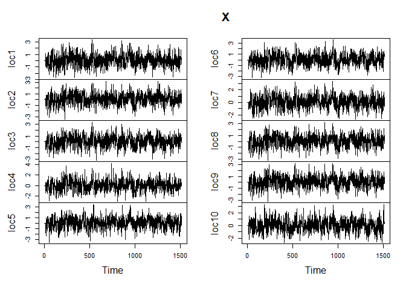

<!-- README.md is generated from README.Rmd. Please edit that file -->

# mcgf

<!-- badges: start -->
<!-- badges: end -->

The goal of `mcgf` is to provide easy-to-use functions for simulating
and fitting covariance models. This package has functions to simulate
samples for Markov chain Gaussian fields with covariance functions of
the Gneiting class by simple kriging. Parameter estimation methods such
as weighted least squares and maximum likelihood estimation are
available.

## Installation

You can install the development version of mcgf from
[GitHub](https://github.com/) with:

``` r
# install.packages("devtools")
devtools::install_github("tianxia-jia/mcgf")
```

## Data Simulation

To simulate a MCGF with fully symmetric covariance structure, we first
create distance arrays for 10 locations:

``` r
set.seed(123)
dist1 <- rnorm(sum(1:9), mean = 0, sd = 100)
dist2 <- rnorm(sum(1:9), mean = 0, sd = 100)

h1 <- h2 <- matrix(NA, nrow = 10, ncol = 10)
h1[upper.tri(h1)] <- dist1
h2[upper.tri(h2)] <- dist2
diag(h2) <- diag(h1) <- 0
h1[lower.tri(h1)] <- -t(h1)[lower.tri(h1)]
h2[lower.tri(h2)] <- -t(h2)[lower.tri(h2)]
h <- sqrt(h1 ^ 2 + h2 ^ 2)

dists <- list(h = h, h1 = h1, h2 = h2)
```

Next, we simulate a MCGF.

``` r
library(mcgf)
par_s <- list(nugget = 0.1, c = 0.001, gamma = 0.3)
par_t <- list(a = 5, alpha = 0.5)
par_base <- list(par_s = par_s, par_t = par_t)

set.seed(123)
X <- mcgf_sim(N = 1000, base = "sep", lagrangian = "none", par_base = par_base,
              dists = dists, lag = 10)
plot.ts(X)
```



## Parameter Estimation

To estimate parameters using weighted least squares method, we need to
calculate autocorrelations and cross-autocorrelations. Let’s first
create a `mcgf` object. The `mcgf` class extends the `data.frame` with
more attributes.

``` r
x_mcgf <- mcgf(X, dists = dists)
#> `time` not provided, assuming rows are equally spaced temporally.
```

Then the acfs and ccfs can be added to this object as follows.

``` r
x_mcgf <- add_acfs(x = x_mcgf, lag_max = 10)
x_mcgf <- add_ccfs(x = x_mcgf, lag_max = 10)
```

To find the weighted least squares, we can run

``` r
fit_base(x = x_mcgf, lag = 10, model = "sep", optim_fn = "nlminb",
         par_init = list(a = 1, alpha = 0.5, nugget = 0.2, c = 0.001, 
                         gamma = 0.3),
         method = "wls")
#> $par
#>         c     gamma    nugget         a     alpha 
#> 0.0000000 0.2471450 0.0000000 4.6845646 0.4749422 
#> 
#> $objective
#> [1] 0.8006263
#> 
#> $convergence
#> [1] 0
#> 
#> $iterations
#> [1] 15
#> 
#> $evaluations
#> function gradient 
#>       18      110 
#> 
#> $message
#> [1] "relative convergence (4)"
#> 
#> $par_names
#> [1] "c"      "gamma"  "nugget" "a"      "alpha"
```

To find the maximum likelihood estimates, we run

``` r
fit_base(x = x_mcgf, lag = 10, model = "sep", optim_fn = "nlminb",
         par_init = list(a = 1, alpha = 0.5, nugget = 0.2, c = 0.001, 
                         gamma = 0.3),
         method = "mle")
#> $par
#>            c        gamma       nugget            a        alpha 
#> 0.0001008375 0.5000000000 0.0990811226 4.9403736621 0.5123058177 
#> 
#> $objective
#> [1] -7559.687
#> 
#> $convergence
#> [1] 0
#> 
#> $iterations
#> [1] 121
#> 
#> $evaluations
#> function gradient 
#>      178      706 
#> 
#> $message
#> [1] "relative convergence (4)"
#> 
#> $par_names
#> [1] "c"      "gamma"  "nugget" "a"      "alpha"
```

## Regime-Switching MCGF

Regime-switching MCGF can be simulated as

``` r
par_s <- list(nugget = 0.5, c = 0.01, gamma = 0.5)
par_t <- list(a = 1, alpha = 0.5)
par_base <- list(par_s = par_s, par_t = par_t)
par_lagr <- list(v1 = 5, v2 = 10)

set.seed(123)
labels <- sample(1:2, 1000, replace = TRUE)
X <- mcgf_rs_sim(N = 1000,
                 labels = labels,
                 base_ls = list("sep"),
                 lagrangian_ls = list("none", "lagr_tri"),
                 lambda_ls = list(0, 0.5),
                 par_base_ls = list(par_base),
                 par_lagr_ls = list(NULL, par_lagr),
                 dists_ls = list(dists, dists))
plot.ts(X[, -1])
```


